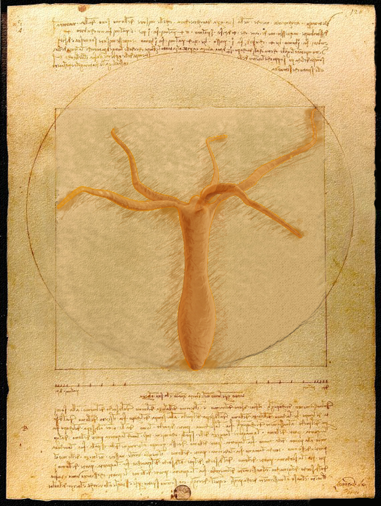

Most of this should live on [Instagram](https://www.instagram.com/suyash_suedt/) but I like the customization and control here. If you like any of these or would like a print please let me know.
I would be more than happy to share!

<!--
The lightbox="true" makes them click-to-expand automatically
     (requires: quarto add quarto-ext/lightbox)
-->

::: {.art-gallery}

{.lightbox description="Hydra Vitruvian —  As on one branch so on the other, virtuvian symmetry organizing body structure in the hydra. Made in the endings of a early journey, 2017."}

{.lightbox description="Hydra Ssil —  A hydra, a tree, and the movement on the tree of life. Made to celebrate [this discovery](https://doi-org/10.1242/jeb.232702), 2020."}

{.lightbox description="Zebrafish —  The mind boggling mysteries of fish skin morphogensis. Made at a time of flowing thoughts and ideas, 2021."}

:::
