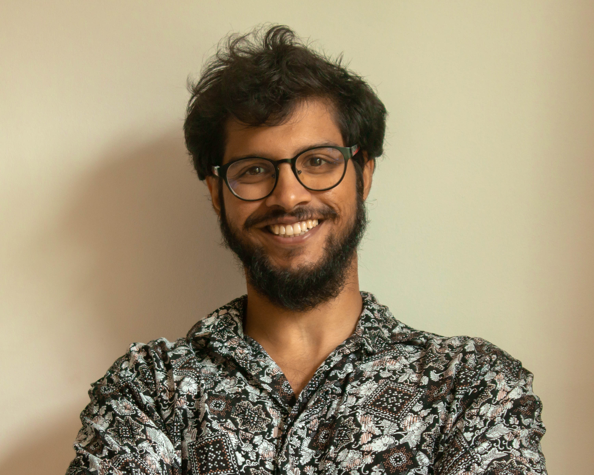

```{=html}
<section class="hero">
  <div class="hero-text">
    <p class="hero-eyebrow">Hi, I'm</p>
    <h1 class="hero-name">Dr Suyash Naik</h1>
    <p class="hero-tagline">
      I turn complex, ambiguous problems into crystal clear answers —
      whether that's decoding how embryos self-organise or leading
      transformational programmes.
    </p>
    <p class="hero-sub">
      PhD Developmental Biology &amp; Biophysics· IST Austria · Image Analysis Expert
    </p>
    <div class="hero-cta">
      <a href="projects/index.qmd" class="btn-primary">See my work</a>
      <a href="cv.qmd" class="btn-outline">Download CV</a>
    </div>
  </div>
  <div class="hero-photo">
    
  </div>
</section>
```

---

## What I do

PhD in Developmental Biophysics from [IST Austria](https://ista.ac.at/en/home/) —  where I used live imaging, AI/ML driven advanced data/image analysis and quantitative modelling to understand how physical forces drive tissue organisation during embryonic development. During this work I also contributed to securing **€500K+ in competitive research funding**, and built analytical capability across **10+ early-career researchers** in microscopy, image analysis, and data science.

Since completing [my PhD](https://www.nature.com/articles/s41467-026-72366-z), I work as an **Image Analysis Expert** at ISTA, where I've **advised 500+ researchers** institute-wide on experimental design and analytical pipelines, and led the cross-functional migration of 60+ microscopy workstations across imaging, IT, and cybersecurity teams — with zero disruption to operations.

Outside the lab I have lead [PhD Balance](https://www.phdbalance.com/) a global NGO social media team to a **25,000-strong following over five years**, and co-founded two international academic seminar series that ran 100+ sessions across four years — all without formal authority or dedicated resources.

I'm drawn to environments where structured out-of-the-box thinking, clear communication, and the ability to work across disciplines create measurable impact.

---

## Skills at a glance

::: {.skills-grid}

::: {.skill-card}
**Quantitative analysis**
Python · R · MATLAB · Image analysis pipelines · Statistical modelling
:::


::: {.skill-card}
**Communication**
Science writing · Data visualisation · Teaching · PhDBalance social media  · Canva 
:::

::: {.skill-card}
**Tools**
Git / GitLab CI · Quarto · LaTeX · Fiji/ImageJ · Napari 
:::
<!--

::: {.skill-card}
**Wet lab**
Live fluorescence imaging · Laser ablation · Micropipette Aspiration · Atomic force Microscopy · Zebrafish & organoid models
:::
-->

:::

---

## Recent work

::: {.project-teaser}
### [Epithelial tension during gastrulation](projects/gastrulation.qmd)
Using laser ablation and mechanical modelling to map how stress fields guide tissue flow in the early zebrafish embryo.
:::

::: {.project-teaser}
### [Quantifying cell shape dynamics](projects/cell-shape.qmd)
An image analysis pipeline (Python + Napari) to extract morphometric features from 3D timelapse data.
:::

[All projects →](projects/index.qmd)

---

::: {.art-footnote}
I also make [illustrations](art/index.qmd) — mostly about biology, occasionally about everything else.
:::
