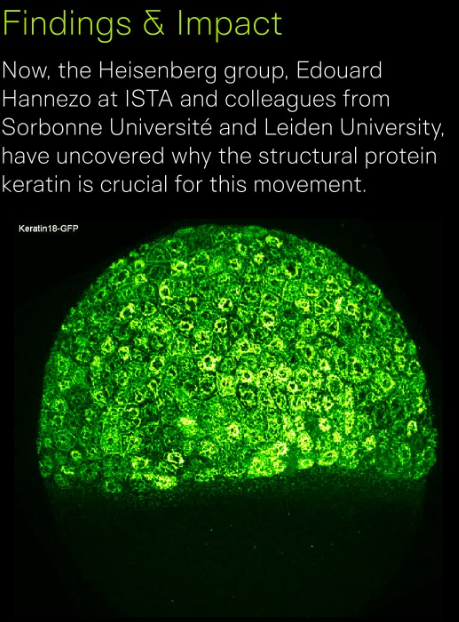

## The Challenge

After five years of PhD experiments , a collaboration spanning institutions across 3 countries — microscopy, laser ablation, pipette aspiration, simulations — I had 40 TB of raw data, and no shared system to organize and reproduce any of it. 

Traditionally, in Biological research labs, data is rarely documented or version-controlled systematically. Without a system, regenerating a single figure means days of manual work and no guarantee of consistency. 

I built one that could do it in an afternoon. This is how.

## What I Built

I designed a modular, figure-centric analysis pipeline from first principles, treating the paper as a product and each figure as a tracked deliverable.

::: {.stats-strip}
::: {.stat}
[40 TB+]{.stat-value} [raw data consolidated]{.stat-label}
:::
::: {.stat}
[12]{.stat-value} [figures, all reproducible]{.stat-label}
:::
::: {.stat}
[215]{.stat-value} [commits of audit trail]{.stat-label}
:::
::: {.stat}
[3]{.stat-value} [institutions coordinated]{.stat-label}
:::
::: {.stat}
[7 ]{.stat-value} [ contributors across 3 countries]{.stat-label}
:::
:::

**Repository architecture** —   a structured Git repo with per-figure folders and six dedicated notebooks, designed so collaborators could work in parallel without waiting on a central coordinator — cutting the back-and-forth that slows most multi-institution projects. 

**Standardised ingestion** — all raw experimental data and simulation outputs (from collaborators Dr. Yann-Edwin Keta at ESPCI Paris and Dr. Silke Henkes at Leiden University) were normalised into a single format. Three countries, three languages, one schema.

**Single-source-of-truth figures** — every figure is generated directly from raw data via its own notebook, with no manual steps in between. Changing a parameter, colour scheme, or dataset propagates automatically across the entire paper. This eliminated a whole category of human error risk.

**Future-proofed environment** — the full analysis environment is reproducible in a single command, with every dependency pinned to an exact version. Step-by-step documentation ensures any future researcher — or journal reviewers — can recreate results independently, with no configuration required.

**Cross-continental coordination** — managed asynchronous collaboration across three countries over two years, aligning contributors on data standards, figure revisions, and code conventions with standards that fit publishers.

**Data consolidation at scale** — 40 TB of raw experimental data, collected across five years using ever changing bio-image formats and conventions, was systematically catalogued, cleaned, and reduced into structured datasheets that feed directly into the pipeline.  Every number in the paper traces back to a specific archieved file. 

**The pipeline wasn't designed once and handed over** — it evolved across 2.5 years as the scientific story changed. 

{fig-alt="Pipeline architecture overview" .project-image .lightbox}

Figures were added, reframed, and cut entirely. 

Reviewer feedback demanded new analyses mid-process. 

The system had to be flexible enough to absorb that ambiguity without breaking — and robust enough that every change was traceable.

## The Result

The paper was submitted to [*Nature Communications*](https://www.nature.com/articles/s41467-026-72366-z). Every figure — across **12 panels drawing on 40 TB of source data** — is fully reproducible and stays reproducible from a single resource, with no manual steps and no institutional knowledge required.

The real test came the day before my PhD defence. I needed a different colour scheme for my slides, so I regenerated all 12 figures from scratch. It took under 6 hours. Without the pipeline, the same task would have taken days — and risked introducing inconsistencies across the paper.

The full repository is publicly archived under CC BY-SA 4.0 as an open-science resource.

## The External Stress Test

The first stress test was self-imposed. The second one wasn't.

Two months after publication, a reader posted a comment on PubPeer about the source data behind Figure 7F: a block of values in the control condition appeared twice, in the same order. Not a challenge to the biology — a claim about a file. A duplicated sample, introduced during data assembly.

It is exactly the class of error that no reader can see. It does not change the shape of a plot. It leaves no visual artefact. It sits inside a source-data table that nobody — not five expert reviewers, not four authors, not me — reads row by row. It is an accounting error, not an analytical one.

This pipeline made it possible to correct in 3 hours. 

**Log it.** I opened a public issue in the data repository and quoted the comment in full. The error report entered the same system as every figure in the paper: numbered, visible, attributable, closeable. The archived raw data was brought back online and the analysis repository reopened to redo the data assembly.

**Locate it.** Because every panel is generated from raw data by a single notebook with no manual steps, the path from *figure* to *notebook* to *source table* to *sample* is a walk, not a search. Across 40 TB of catalogued source data, finding the fault was one traversal. The wrong sample was replaced with the correct one.

**Rebuild it.** Figure 7F was regenerated from raw data and every associated test re-run end to end. The issue was closed against the commits that fixed it.
::: {.stats-strip}
::: {.stat}
[3 h]{.stat-value} [of work, comment to corrected figure]{.stat-label}
:::
::: {.stat}
[40 TB]{.stat-value} [searched in one traversal]{.stat-label}
:::
::: {.stat}
[3]{.stat-value} [commits to resolve]{.stat-label}
:::
::: {.stat}
[0]{.stat-value} [conclusions changed]{.stat-label}
:::
:::

The commits are dated across three days. The work inside them is three hours. Nothing forced that gap closed, so I didn't force it: I knew what had gone wrong within minutes of reading the comment, and the calendar bought sleep and time to walk my co-authors through the change before it went public.

That distance between elapsed time and effort is the whole argument. There was no archaeology. No hunting for a file across five years of storage. No reconstructing a two-year-old analysis from memory. No waiting on the one person who knew where the data lived. Every hour that passed was a decision, not a delay, which is only true when you already know exactly what you are looking at.

**The pipeline did not prevent this error, and it was never going to.** Data assembly has human in it. What the pipeline changed is the *cost* of the error: cheap to locate, cheap to correct, impossible to quietly leave alone. In a project without one, the same comment produces weeks of reconstruction and an uncomfortable silence while it happens.

That silence is what damages a paper. Not the duplicated sample.

Reproducibility is not a box ticked at submission. It is a liability the corresponding author carries for as long as the paper is cited, and the only way to carry it cheaply is to have built the system before you needed it. Two years after the pipeline was designed and three months after the paper was published, a stranger on the internet stress-tested it without warning.

The system held.

::: {.project-links}
[View repository →](https://github.com/Suyash-Naik/2026-Keratinepithelialspreadingcoordinate-Data){.btn-outline}
:::
